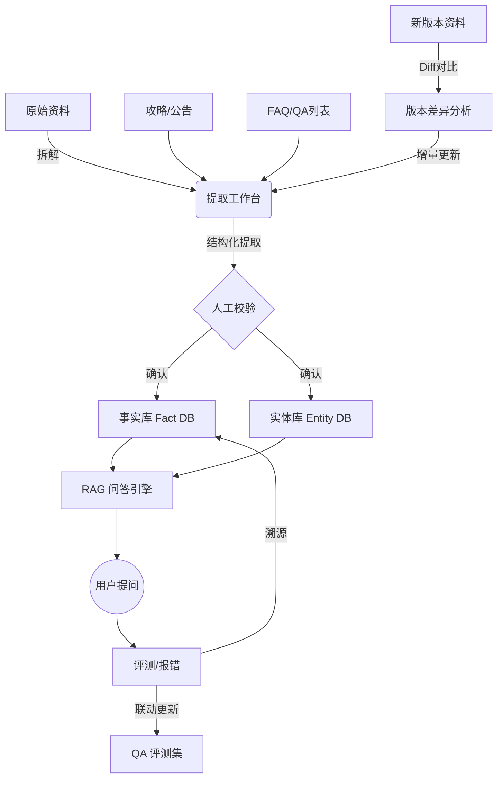

# 事实库配置平台 - 需求规格说明书 (PRD)

## 第一部分：父需求 (Parent Requirements)

### 1.1 项目背景与业务目标
**背景**：
在当前的【瓦手】游戏运营中，存在大量非结构化的攻略文档、版本更新公告以及 FAQ 问答对。传统的关键词检索或直接长文本阅读无法应对复杂的玩家提问（如涉及数值计算、多条件判断的问题），且极易产生大模型“幻觉”。
我们需要构建一个**高精度的结构化事实库**，将松散的资料转化为图谱化的“实体-事实-事件”网络，并结合 QA（问答对）数据进行双向校验，从而为线上的智能客服与助手提供可信的知识底座。

**核心目标**：
1.  **资产结构化**：建立以“实体（Entity）”为骨架，“事实（Fact）”为血肉的知识图谱。
2.  **构建自动化**：提供从长文本/QA 到结构化事实的高效提取与清洗工作台。
3.  **维护闭环化**：实现 `资料 -> 事实 -> 评测 -> 修复 -> 更新` 的全链路闭环，确保知识库与游戏版本同步。

### 1.2 核心概念与数据模型
系统围绕以下四大核心资产流转：

1.  **实体 (Entity)**：游戏中的名词对象（如：角色“捷风”、武器“狂徒”、地图“亚海悬城”）。
2.  **事件 (Event)**：具有时效性或阶段性的动态概念（如：“2024年春季赛”、“v7.0版本更新”）。
3.  **事实 (Fact)**：描述实体属性或关系的最小知识单元（如：“捷风的E技能是顺风”、“狂徒的价格是2900”）。
4.  **问答对 (QA)**：用于验证事实准确性的“问题-答案”对，既是来源也是评测标准。

### 1.3 全局工作流 (Workflow)

### 1.4 模块架构与关联
*   **基础层**：实体管理、事件管理（为事实提供挂载点）。
*   **构建层**：事实提取工作台（核心生产力工具，输入文本/QA，输出事实）。
*   **管理层**：事实管理、内容库（数据的存储、分类与检索）。
*   **应用层**：问题回复/Fact RAG、错误表述检测（验证与监控）。
*   **辅助层**：QA 管理、版本对比工具（维护与迭代支持）。

---

## 第二部分：子需求 (Sub-Requirements)

### 子需求 1：实体与事件库管理 (Entity & Event Management)
**场景**：
在构建事实之前，必须先定义“通过什么来讲故事”。比如要录入“捷风的技能”，必须先在系统中存在“捷风”这个角色实体。

**功能描述**：
1.  **图谱化管理**：支持以“树状图谱”或“列表”两种视图管理实体。
2.  **类型定义**：区分“实体”与“事件”。
3.  **关系建模**：通过“父级分类”建立层级（如：`道具 -> 武器 -> 步枪 -> 狂徒`）。

**操作交互**：
*   **列表/图谱切换**：顶部工具栏切换视图。
*   **新建实体**：弹窗填写名称、别名、所属父级分类。
*   **编辑**：修改实体的属性或调整其在图谱中的位置。

**数据流关系**：
*   **输入**：人工定义的元数据。
*   **输出**：为【事实提取】模块提供“实体链接（Entity Linking）”的候选词表；为【事实管理】提供分类维度。

---

### 子需求 2：事实提取与构建工作台 (Fact Extraction & Construction)
**场景**：
运营人员拿到一份几千字的《新版本英雄改动公告》或一份 Excel 格式的 FAQ，需要将其转化为数据库能懂的结构化条目。

**功能描述**：
1.  **多源导入**：
    *   **长文本解析**：支持粘贴纯文本，AI 自动进行指代消除、时效性过滤。
    *   **QA 结构化导入**：支持导入 `Question | Answer` 格式数据，提取事实并自动关联来源 QA。
2.  **三阶段工作流**：
    *   **解析**：清洗文本，识别候选实体。
    *   **实体确认**：新发现的专有名词，是“新建实体”还是“忽略”。
    *   **事实入库**：交通灯机制（绿灯通行/黄灯重复/红灯冲突），人工最终确认入库。

**操作交互**：
*   **步骤一**：输入文本/文件 -> 点击解析。
*   **步骤二**：网格卡片展示新词 -> 勾选确认入库或标记无效。
*   **步骤三**：左侧对比“原文 vs 提取结果” -> 右侧展示图谱关联 -> 点击 [确认入库]。

**数据流关系**：
*   **输入**：非结构化文本、FAQ Excel、新版本补丁文档。
*   **引用**：读取【实体库】进行关键词匹配。
*   **输出**：写入【事实库】（新增 Fact）；写入【实体库】（新增 Entity）；写入【QA 库】（若源为 QA）。

---

### 子需求 3：事实库维护与版本管理 (Fact Management & Maintenance)
**场景**：
游戏更新了 v7.0 版本，大量旧数据过期；或者评测发现“狂徒伤害”记错了，需要修正。

**功能描述**：
1.  **事实检索与编辑**：按实体、类型、状态筛选事实，支持富文本编辑。
2.  **版本差异对比 (Diff)**：
    *   上传新旧两份 QA/文档，系统自动识别 `新增`、`变更`、`删除` 的内容。
    *   一键生成“待处理任务列表”。
3.  **相似错误批量修复**：
    *   当修正一条事实（如修改某武器攻击力）时，系统推荐结构相似的其他事实（如其他等级的攻击力），支持批量修改。

**操作交互**：
*   **列表页**：左侧分类树筛选 -> 右侧卡片展示详情。
*   **版本对比页**：拖拽上传两个文件 -> 渲染差异表格（高亮显示不同） -> 操作列点击 [应用更新]。

**数据流关系**：
*   **输入**：人工维护指令、新版本文档流。
*   **输出**：更新【事实库】状态（生效/过期）；触发【QA 库】的联动标记（标记关联 QA 为“需复核”）。

---

### 子需求 4：QA 评测与联动闭环 (QA Evaluation & Feedback)
**场景**：
验证构建好的事实库是否真的能回答玩家问题；以及当发现回答错误时，如何快速定位是哪条事实出了问题。

**功能描述**：
1.  **Fact RAG 模拟器**：
    *   模拟玩家提问，展示 RAG 检索过程（意图识别 -> 实体召回 -> 事实引用 -> 答案生成）。
2.  **溯源与报错**：
    *   在回答下方展示引用的 Fact ID。
    *   支持“点踩”并填写错误原因，直接生成一条“待办工单”推送到事实管理模块。
3.  **QA 库联动**：
    *   如果事实被修改，系统自动查找所有引用该事实的 QA 对，将其状态置为 `Pending Review`，提示运营重新跑测。

**操作交互**：
*   **模拟对话区**：左侧聊天窗口 -> 右侧透明展示思维链（Trace）。
*   **错误反馈**：点击“引用不当” -> 跳转到事实详情页进行修改。

**数据流关系**：
*   **输入**：用户/测试人员的 Query。
*   **调用**：检索【事实库】与【实体库】。
*   **输出**：Badcase 报告 -> 反向推动【子需求 2】或【子需求 3】的执行。
